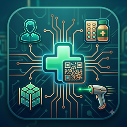
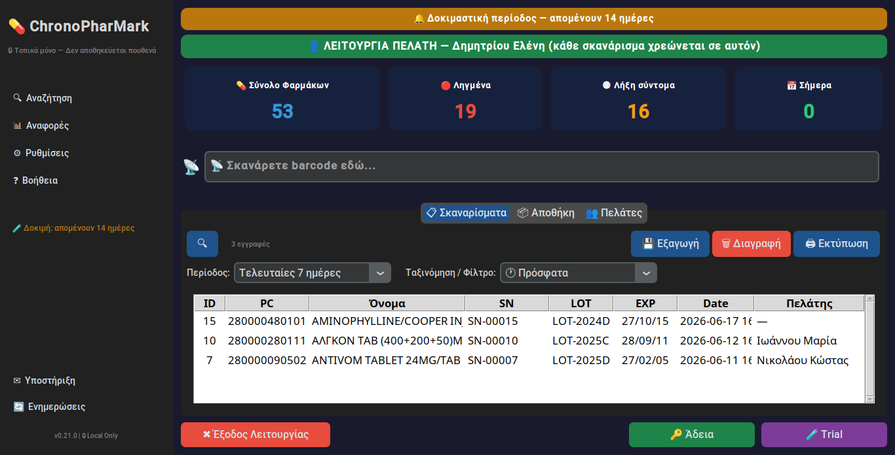
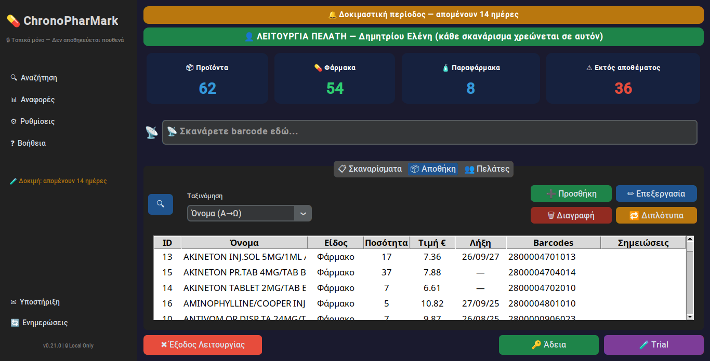
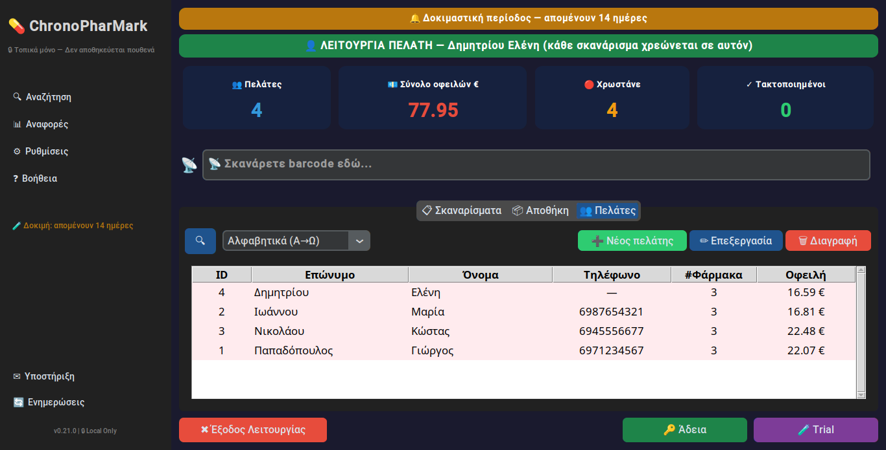
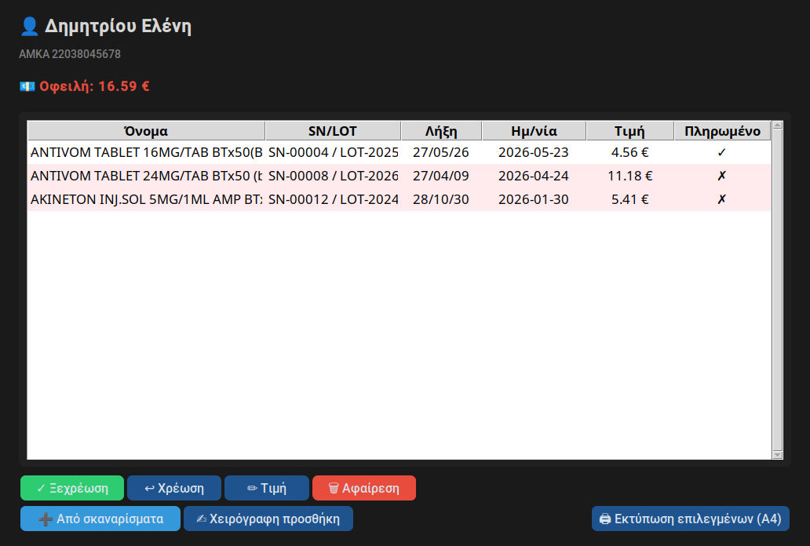
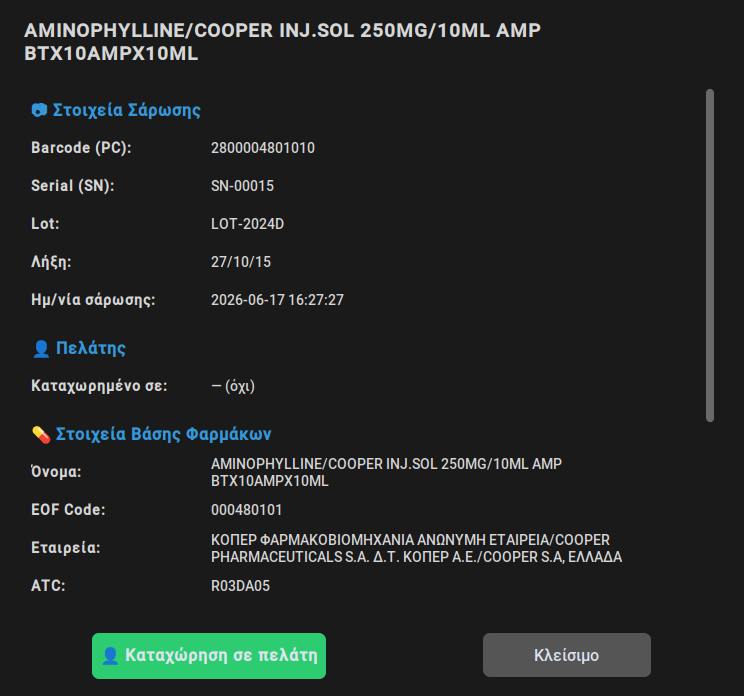
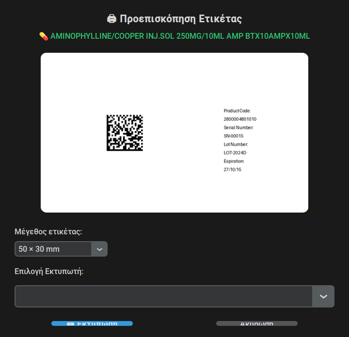
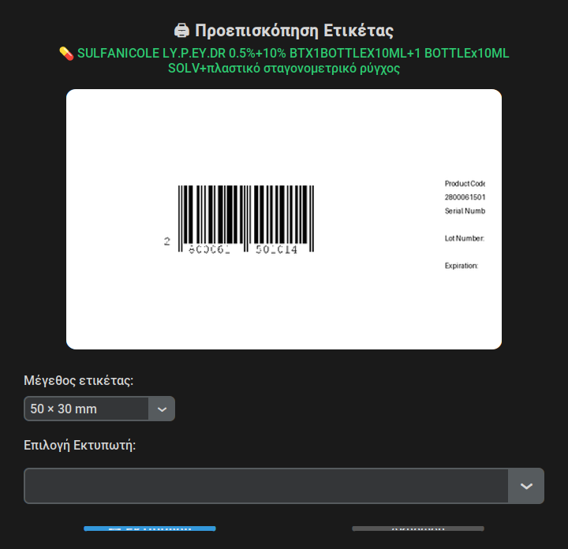

# ChronoPharMark

### Έξυπνη διαχείριση φαρμακείου — σάρωση, λήξεις, αποθήκη, πελάτες & εκτυπώσεις

**100% τοπικά στον υπολογιστή σας. Κανένα δεδομένο δεν φεύγει από το φαρμακείο.**

---

## 🖼 Δείτε την εφαρμογή

### 📋 Σκαναρίσματα + Λειτουργία Πελάτη — κάθε σκανάρισμα χρεώνεται αυτόματα

### 📦 Αποθήκη με τιμές & απόθεμα

### 👥 Πελάτες & αναλυτική καρτέλα (χρεώσεις, τιμές, Πληρωμένο/Απλήρωτο, οφειλή)

| Λίστα πελατών | Καρτέλα πελάτη |
|:---:|:---:|
|  |  |

### 💊 Αναλυτικά στοιχεία φαρμάκου (από την ενσωματωμένη βάση)

### 🖨 Σωστά barcodes για εκτύπωση — **2D GS1 DataMatrix** (συνταγογράφηση) & **1D EAN-13**

| GS1 DataMatrix (2D) | EAN-13 (γραμμωτό, 1D) |
|:---:|:---:|
|  |  |

---

## ✨ Τι κάνει

- 📷 **Ενιαίο σκανάρισμα** — μία λίστα για ό,τι σκανάρετε· αναγνώριση φαρμάκου
  (κωδικός, παρτίδα, λήξη) **και λιανική τιμή** από ενσωματωμένη βάση. Άγνωστα
  μπαίνουν αυτόματα ως «Άγνωστο».
- 🖨 **Σωστά barcodes** — επανεκτύπωση **GS1 DataMatrix** (για ηλεκτρονική
  συνταγογράφηση) ή **EAN-13** για παλιά φάρμακα, με **ρυθμιζόμενο μέγεθος**.
- 👤 **Λειτουργία Πελάτη** — επιλέγετε πελάτη και **κάθε σκανάρισμα χρεώνεται
  αυτόματα** σε αυτόν, με την τιμή του προϊόντος.
- 📡 **Σκανάρισμα στο παρασκήνιο** — πιάνει το σκανάρισμα ακόμη κι όταν είστε σε
  **άλλο παράθυρο** (π.χ. στη συνταγογράφηση), με το πρόγραμμα ελαχιστοποιημένο.
- ⏳ **Έλεγχος λήξης** — ημερομηνία λήξης ανά εγγραφή, φίλτρα & περίοδοι.
- 📦 **Αποθήκη** — απόθεμα & **τιμές**, παραφάρμακα, παραλαβή με σάρωση, διπλότυπα.
- 👥 **Πελάτες** — καρτέλα πελάτη, χρεώσεις με τιμή & «Πληρωμένο/Απλήρωτο».
- 🖨 **Εκτυπώσεις A4** — πολλαπλή επιλογή → πλέγμα σε A4 (λιγότερο χαρτί).
- ☁ **Αυτόματο backup** — σε φάκελο Google Drive/OneDrive ή απευθείας στο cloud.
- 🔄 **Αυτόματες ενημερώσεις** — με ένα κλικ.

---

## ⬇️ Λήψη & Εγκατάσταση

1. Κατεβάστε το **`ChronoPharMark-Setup.exe`** από την
   [τελευταία έκδοση](https://github.com/chronopharmark/ChronoPharMark-releases/releases/latest).
2. Τρέξτε το και ακολουθήστε τον οδηγό εγκατάστασης.
3. Ανοίξτε το ChronoPharMark από το μενού Έναρξη ή τη συντόμευση.

> Υπάρχει και **φορητή έκδοση** (`ChronoPharMark-portable.zip`) — αποσυμπιέστε
> και τρέξτε, χωρίς εγκατάσταση.

---

## 🔑 Δοκιμή & Άδεια

Η εφαρμογή ξεκινά με **δωρεάν δοκιμή 14 ημερών**. Για συνέχιση χρειάζεται άδεια —
οι οδηγίες ενεργοποίησης εμφανίζονται μέσα στην εφαρμογή (στείλτε τον κωδικό
μηχανήματος στην υποστήριξη και λάβετε το κλειδί σας).

---

## ☁ Αυτόματο Backup

Σε κάθε κλείσιμο, ένα συμπιεσμένο αντίγραφο **όλων** των δεδομένων σας (σαρώσεις,
πελάτες, αποθήκη) αποθηκεύεται αυτόματα — σε φάκελο Google Drive/OneDrive ή
απευθείας στο cloud. Έτσι δεν χάνετε ποτέ δεδομένα. Πλήρης καθοδήγηση υπάρχει
μέσα στην εφαρμογή.

---

## 🔒 Ιδιωτικότητα & Ασφάλεια

- **Όλα τα δεδομένα μένουν στον υπολογιστή σας.** Καμία αποστολή σε εμάς ή τρίτους
  — εκτός από τα *δικά σας* backup που εσείς ρυθμίζετε.
- Η εφαρμογή λειτουργεί **offline**.

---

## 📞 Υποστήριξη

**Σκαραφίγκας Βασίλειος** · ✉️ chronopharmark@gmail.com

© ChronoPharMark — λογισμικό διαχείρισης φαρμακείου.

