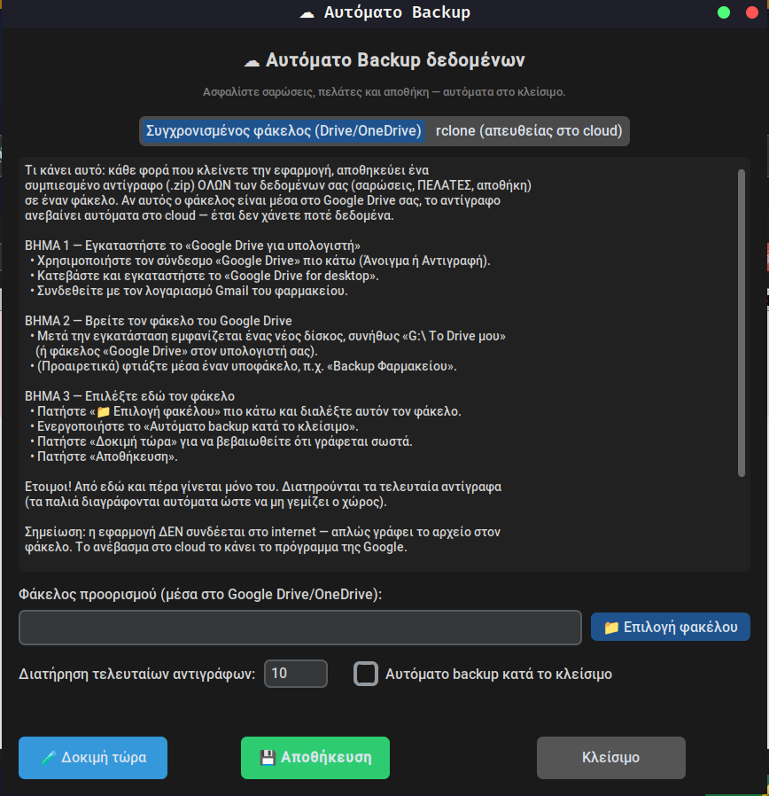

# 💊 ChronoPharMark

### Έξυπνη διαχείριση φαρμακείου — σάρωση, λήξεις, αποθήκη, πελάτες & εκτυπώσεις

**100% τοπικά στον υπολογιστή σας. Κανένα δεδομένο δεν φεύγει από το φαρμακείο.**

---

## 🖼 Δείτε την εφαρμογή

### 📋 Σαρωμένα φάρμακα — έλεγχος λήξης & χρέωση σε πελάτη

### 📦 Αποθήκη με ταξινομήσεις

### 👥 Πελάτες — οφειλές με μια ματιά

| 👤 Καρτέλα πελάτη | ☁ Αυτόματο backup |
|:---:|:---:|
|  |  |

---

## ✨ Τι κάνει

- 📷 **Σάρωση GS1 DataMatrix** — αναγνώριση φαρμάκου (κωδικός, παρτίδα, λήξη) από
  ενσωματωμένη βάση φαρμάκων.
- ⏳ **Έλεγχος λήξης** — χρωματικοί δείκτες & φίλτρα: εντάξει / λήγει σύντομα /
  ληγμένο.
- 📦 **Αποθήκη** — απόθεμα, παραφάρμακα, παραλαβή με σάρωση, εντοπισμός
  διπλοτύπων, ταξινομήσεις.
- 👥 **Πελάτες** — καρτέλα πελάτη, χρέωση φαρμάκων με τιμή & «Πληρωμένο/Απλήρωτο»,
  σύνολο οφειλών.
- 🖨 **Εκτυπώσεις** — ετικέτα με barcode· πολλαπλή επιλογή → πλέγμα σε A4 (λιγότερο
  χαρτί).
- 🔍 **Ενιαία αναζήτηση** — σε σαρώσεις, αποθήκη και πελάτες.
- ☁ **Αυτόματο backup** — σε φάκελο Google Drive/OneDrive ή απευθείας στο cloud.
- 🔄 **Αυτόματες ενημερώσεις** — με ένα κλικ.

---

## ⬇️ Λήψη & Εγκατάσταση

1. Κατεβάστε το **`ChronoPharMark-Setup.exe`** από την
   [τελευταία έκδοση](https://github.com/chronopharmark/ChronoPharMark-releases/releases/latest).
2. Τρέξτε το και ακολουθήστε τον οδηγό εγκατάστασης.
3. Ανοίξτε το ChronoPharMark από το μενού Έναρξη ή τη συντόμευση.

> Υπάρχει και **φορητή έκδοση** (`ChronoPharMark-portable.zip`) — αποσυμπιέστε
> και τρέξτε, χωρίς εγκατάσταση.

---

## 🔑 Δοκιμή & Άδεια

Η εφαρμογή ξεκινά με **δωρεάν δοκιμή 14 ημερών**. Για συνέχιση χρειάζεται άδεια —
οι οδηγίες ενεργοποίησης εμφανίζονται μέσα στην εφαρμογή (στείλτε τον κωδικό
μηχανήματος στην υποστήριξη και λάβετε το κλειδί σας).

---

## ☁ Αυτόματο Backup

Σε κάθε κλείσιμο, ένα συμπιεσμένο αντίγραφο **όλων** των δεδομένων σας (σαρώσεις,
πελάτες, αποθήκη) αποθηκεύεται αυτόματα — σε φάκελο Google Drive/OneDrive ή
απευθείας στο cloud. Έτσι δεν χάνετε ποτέ δεδομένα. Πλήρης καθοδήγηση υπάρχει
μέσα στην εφαρμογή.

---

## 🔒 Ιδιωτικότητα & Ασφάλεια

- **Όλα τα δεδομένα μένουν στον υπολογιστή σας.** Καμία αποστολή σε εμάς ή τρίτους
  — εκτός από τα *δικά σας* backup που εσείς ρυθμίζετε.
- Η εφαρμογή λειτουργεί **offline**.

---

## 📞 Υποστήριξη

**Σκαραφίγκας Βασίλειος** · ✉️ billskar123@gmail.com

© ChronoPharMark — λογισμικό διαχείρισης φαρμακείου.

